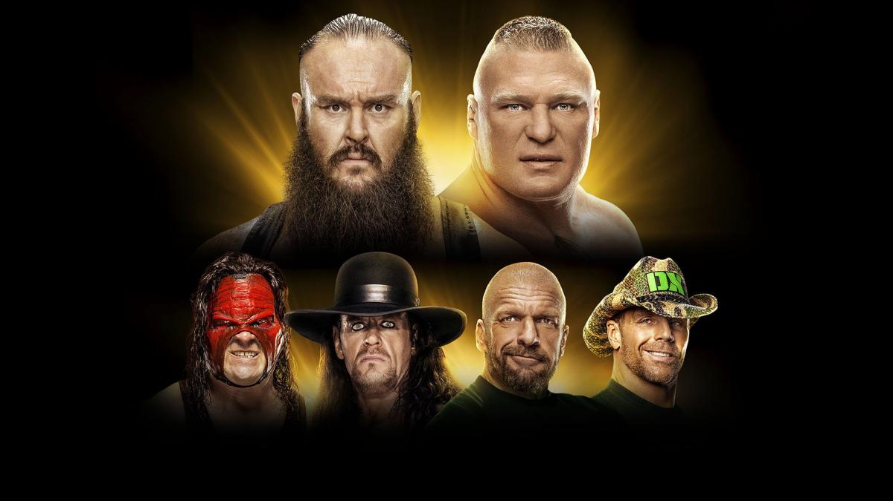
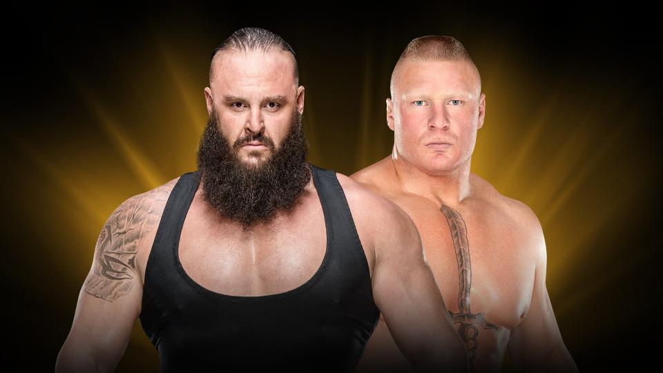
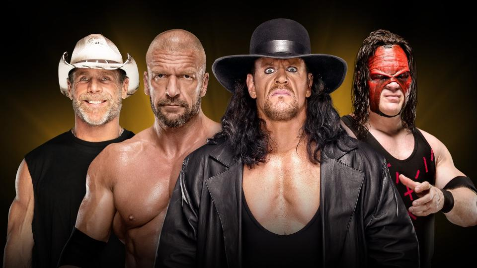
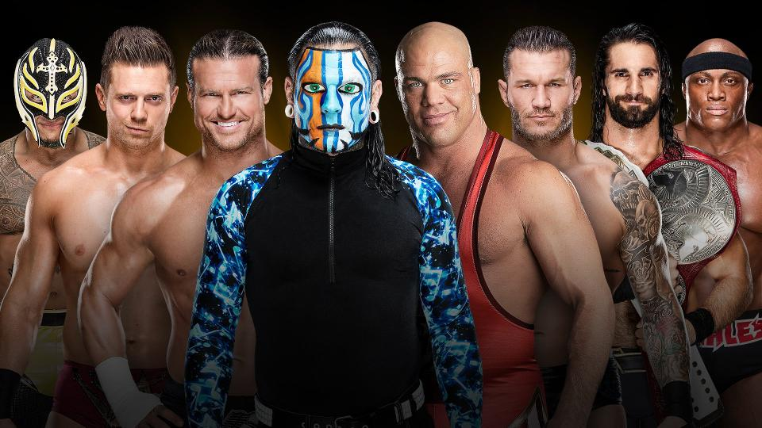
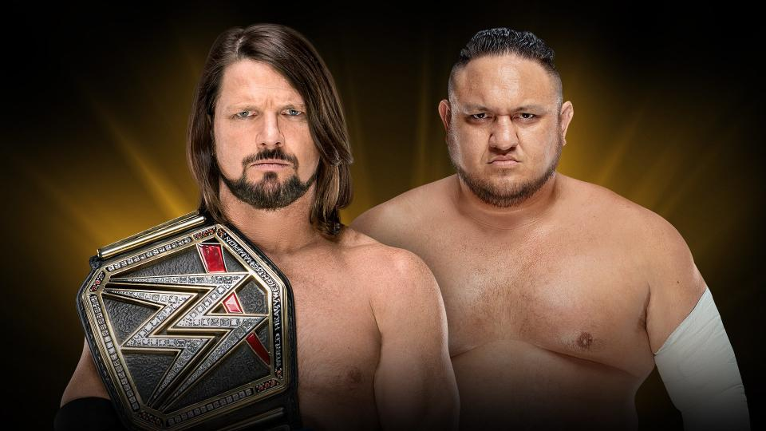
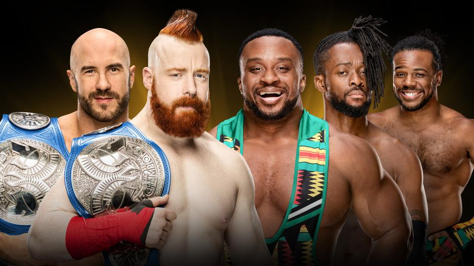
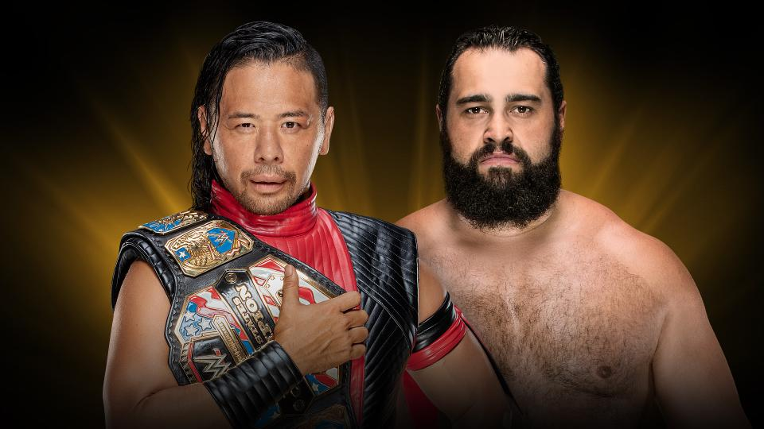

# WWE Crown Jewel

>日期：2018.11.02
>
>地点：沙特阿拉伯，利雅得，国王沙特大学体育场

### Match for the vacant Universal Championship
Brock Lesnar vs. Braun Strowman

### DX battles The Brothers of Destruction 
Triple H & Shawn Michaels vs. The Undertaker & Kane

### Eight-Man World Cup Tournament to take place at WWE Crown Jewel
Kurt Angle vs. Jeff Hardy vs. Randy Orton vs. Seth Rollins vs. Dolph Ziggler vs. The Miz vs. Rey Mysterio vs. Bobby Lashley 

### WWE Championship Match
AJ Styles (c) vs. Samoa Joe

### SmackDown Tag Team Championship Match
The Bar (c) vs. The New Day 

### United States Championship Kickoff Match
Shinsuke Nakamura (c) vs. Rusev

### 赛果：
- Shinsuke Nakamura 战胜 Rusev 卫冕美国冠军

- Hulk Hogan 开场讲话

- Rey Mysterio 战胜 Randy Orton （WWE世界杯首轮）

- The Miz 战胜 Jeff Hardy（WWE世界杯首轮）

- Seth Rollins 战胜 Bobby Lashley （WWE世界杯首轮）

- Dolph Ziggler 战胜 Kurt Angle（WWE世界杯首轮）

- The Bar 战胜 The New Day 卫冕 SmackDown双打冠军

- The Miz 战胜 Rey Mysterio （WWE世界杯半决赛）

- Dolph Ziggler 战胜 Seth Rollins （WWE世界杯半决赛）

- AJ Styles 战胜 Samoa Joe 卫冕WWE冠军

- Brock Lesnar 战胜 Braun Strowman 赢得环球冠军

- Shane McMahon 战胜 Dolph Ziggler （WWE世界杯决赛）

- D-Generation X 战胜 The Brothers of Destruction