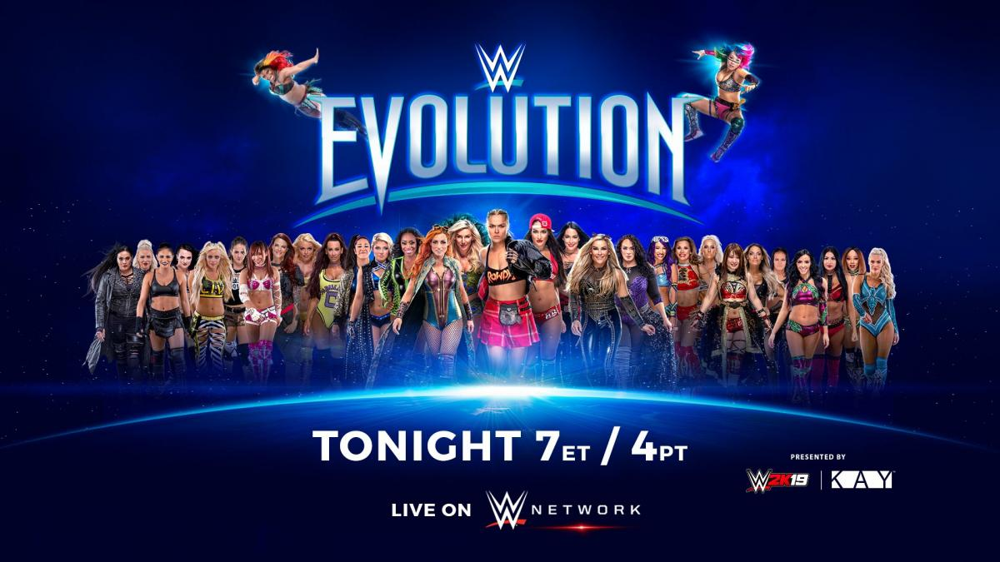
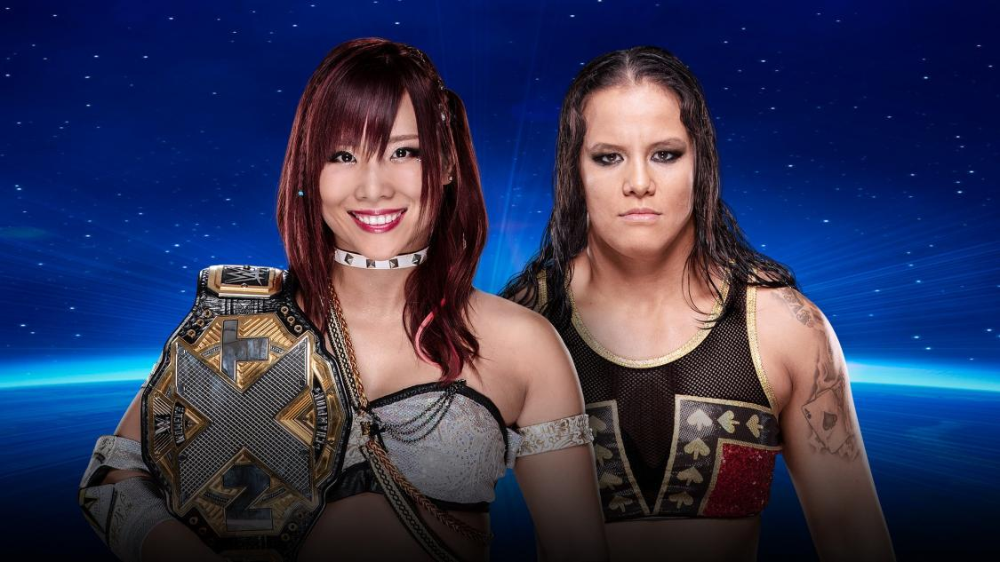

# WWE Evolution

>日期：2018.10.28
>
>地点：纽约，尤宁代尔，拿骚退伍军人纪念体育馆

### Raw Women’s Championship Match
Ronda Rousey (c) vs. Nikki Bella

### SmackDown Women’s Championship Last Woman Standing Match
Becky Lynch (c) vs. Charlotte Flair

### NXT Women’s Championship Match
Kairi Sane (c) vs. Shayna Baszler 

### 2018 Mae Young Classic Final
Io Shirai vs. Toni Storm

### Tag Team Match
Trish Stratus & Lita vs. Mickie James & Alicia Fox (with Alexa Bliss in their corner)

### Six-Woman Tag Team Match
Natalya, Sasha Banks & Bayley vs. The Riott Squad

### Battle Royal — Winner receives future Women’s Championship Match
Asuka vs. Naomi vs. Nia Jax vs. Carmella vs. Ember Moon vs. Billie Kay vs. Peyton Royce vs. Sonya Deville vs. Mandy Rose vs. Lana vs. Zelina Vega vs. Tamina vs. Dana Brooke vs. Torrie Wilson vs. Michelle McCool vs. Alundra Blayze vs. Ivory vs. Molly Holly vs. Kelly Kelly vs. Maria Kanellis

### 赛果：
- Lzzy Hale & Nita Strauss 开场现场

- Trish Stratus & Lita 战胜 Mickie James & Alicia Fox

- Nia Jax 获得 Battle Royal 胜利

- Toni Storm 战胜 Io Shirai

- Sasha Banks, Bayley & Natalya 战胜 The Riott Squad

- Shayna Baszler 战胜 Kairi Sane 成为新科 NXT女子冠军

- Becky Lynch 战胜 Charlotte Flair 卫冕 SmackDown女子冠军

- Ronda Rousey 战胜 Nikki Bella 卫冕 Raw女子冠军
