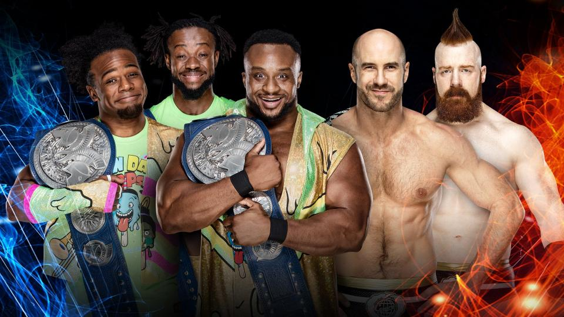

# WWE Super Show-Down

>日期：2018.10.06
>
>地点：维多利亚，墨尔本，墨尔本板球场

### Last Time Ever 
The Undertaker vs. Triple H

The Shield vs. Braun Strowman, Dolph Ziggler & Drew McIntyre

### WWE Championship Match (No Count-outs; No Disqualifications; There Must Be a Winner)
AJ Styles (c) vs. Samoa Joe

Raw Women’s Champion Ronda Rousey & The Bella Twins vs. The Riott Squad

### SmackDown Women's Championship Match
Becky Lynch (c) vs. Charlotte Flair 

John Cena & Bobby Lashley vs. Kevin Owens & Elias

### Winner Gets a WWE Championship Match
Daniel Bryan vs. The Miz

### SmackDown Tag Team Championship Match
The New Day (c) vs. The Bar
 

Asuka & Naomi vs. The IIconics 

### WWE Cruiserweight Championship Match
Cedric Alexander (c) vs. Buddy Murphy

### 赛果：

- The New Day 战胜 The Bar 卫冕 SmackDown双打冠军

- Charlotte Flair 战胜 Becky Lynch （取消资格）

- John Cena & Bobby Lashley 战胜 Kevin Owens & Elias

- The IIconics 战胜 Asuka & Naomi

- AJ Styles 战胜 Samoa Joe 卫冕 WWE冠军

- Ronda Rousey & The Bella Twins 战胜 The Riott Squad

- Buddy Murphy 战胜 Cedric Alexander 成为新科 WWE轻量级冠军

- The Shield 战胜 Braun Strowman, Drew McIntyre & Dolph Ziggler

- Daniel Bryan 战胜 The Miz 成为 WWE冠军挑战者

- Triple H 战胜 The Undertaker
