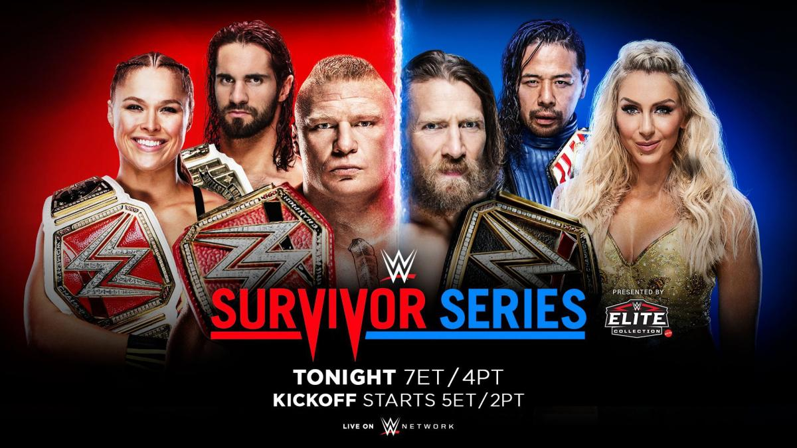
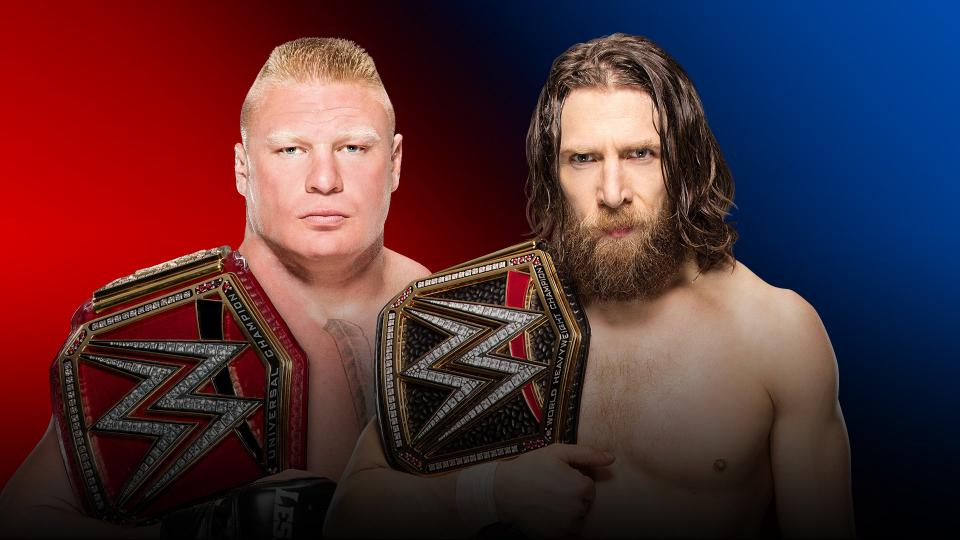
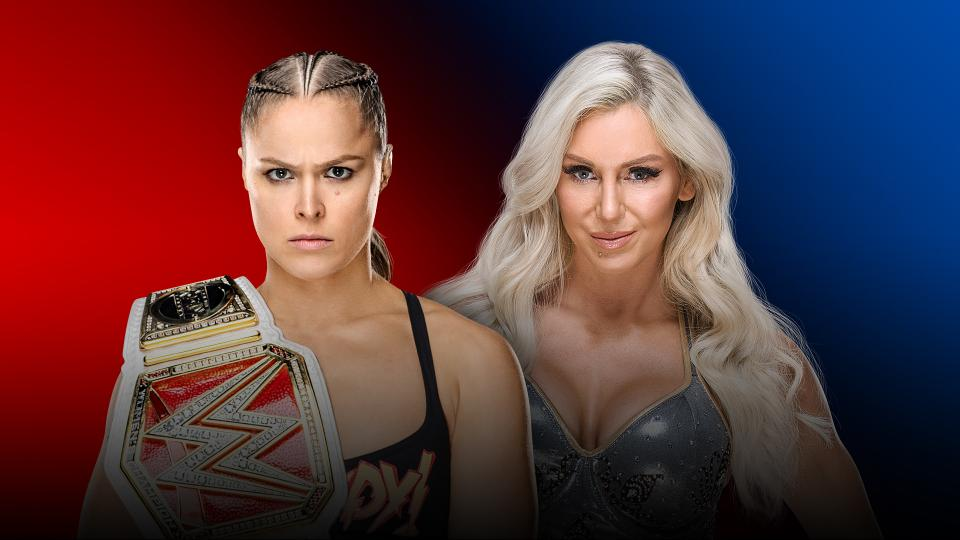
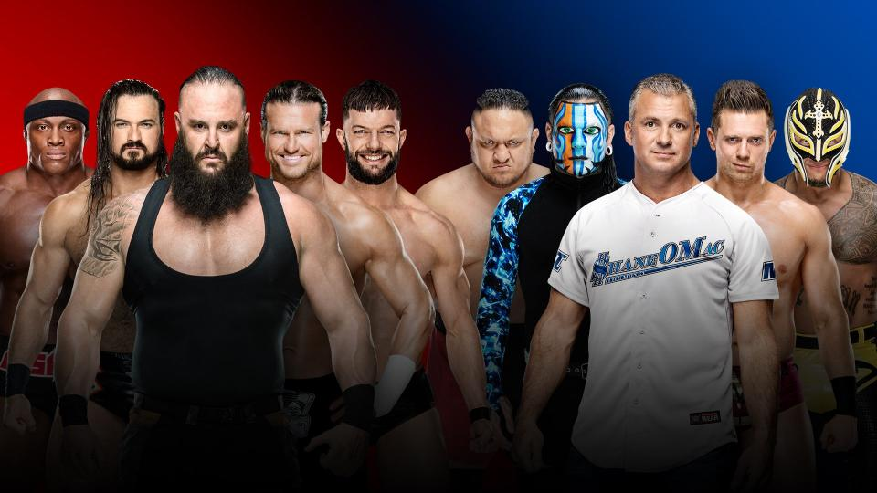
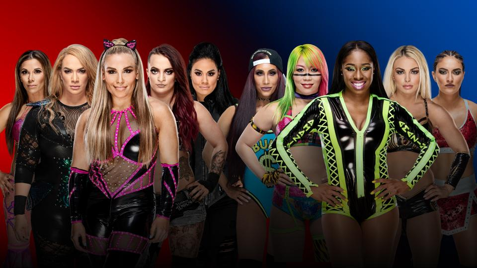
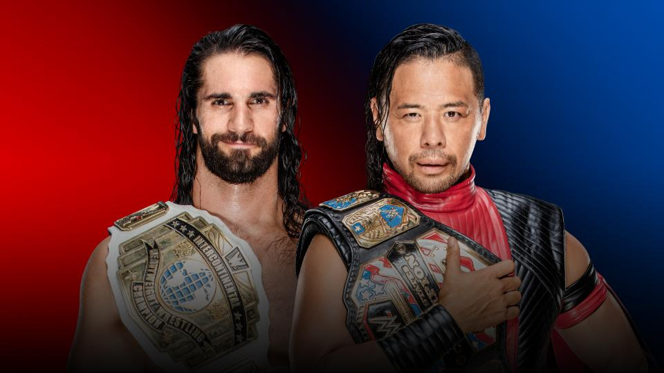
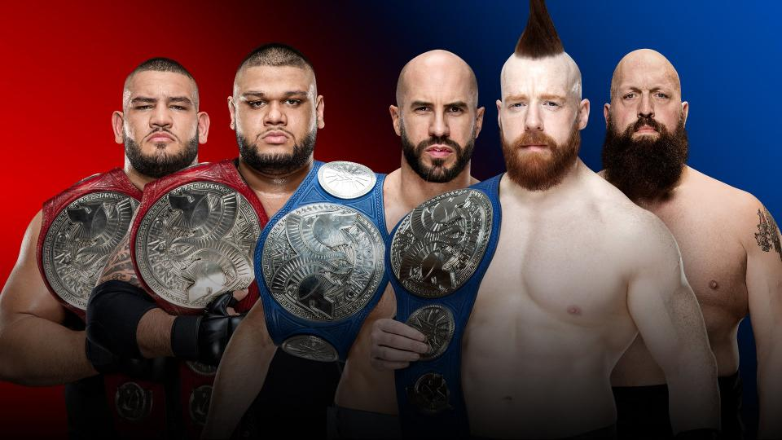
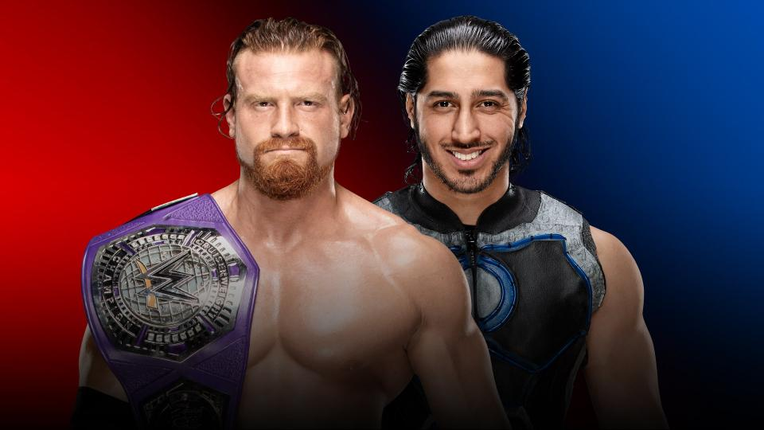
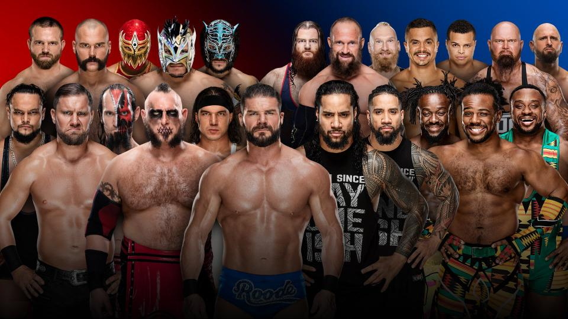

# WWE Fastlane 2019

>日期：2018.11.18
>
>地点：加利福尼亚州，洛杉矶，斯台普斯中心

### Universal Champion vs. WWE Champion Match
Brock Lesnar vs. Daniel Bryan

Raw Women’s Champion Ronda Rousey vs. Charlotte Flair

### Men’s Traditional 5-on-5 Survivor Series Elimination Match
Team Raw (Braun Strowman, Dolph Ziggler, Drew McIntyre, Finn Bálor & Bobby Lashley) vs. Team SmackDown (The Miz, Shane McMahon, Samoa Joe, Rey Mysterio & Jeff Hardy)

### Women’s Traditional 5-on-5 Survivor Series Elimination Match
Team Raw (Nia Jax, Mickie James, Tamina, Sasha Banks & Bayley) vs. Team SmackDown (Asuka, Naomi, Carmella, Sonya Deville & Mandy Rose)

### Champion vs. Champion Match
Intercontinental Champion Seth Rollins vs. United States Champion Shinsuke Nakamura

### Champion vs. Champion Match
Raw Tag Team Champions AOP vs. SmackDown Tag Team Champions The Bar (w/ Big Show)

### WWE Cruiserweight Championship Match
Buddy Murphy (c) vs. Mustafa Ali

### Tag Team Traditional 10-on-10 Survivor Series Elimination Match (Kickoff Match) 
Team Raw (made up of Bobby Roode & Chad Gable, The B-Team, The Revival, The Lucha House Party & The Ascension) vs. Team SmackDown (made up of The Usos, The New Day, Luke Gallows & Karl Anderson, SAnitY & The Colóns) 
 

### 赛果：
- 10-on-10 Tag Team Traditional Survivor Series Elimination Match Team SmackDown胜

- Women’s 5-on-5 Traditional Survivor Series Elimination Match Team Raw胜

- 洲际冠军Seth Rollins 战胜 美国冠军Shinsuke Nakamura

- Raw双打冠军AOP 战胜 SmackDown双打冠军The Bar (w/Big Show)

- Buddy Murphy 战胜 Mustafa Ali 卫冕轻量级冠军

- Men’s 5-on-5 Traditional Survivor Series Elimination Match Team Raw胜

- Ronda Rousey 战胜 Charlotte Flair，Charlotte Flair疯狂攻击Ronda Rousey

- 环球冠军Brock Lesnar 战胜 WWE冠军Daniel Bryan
