# WWE Fastlane 2019

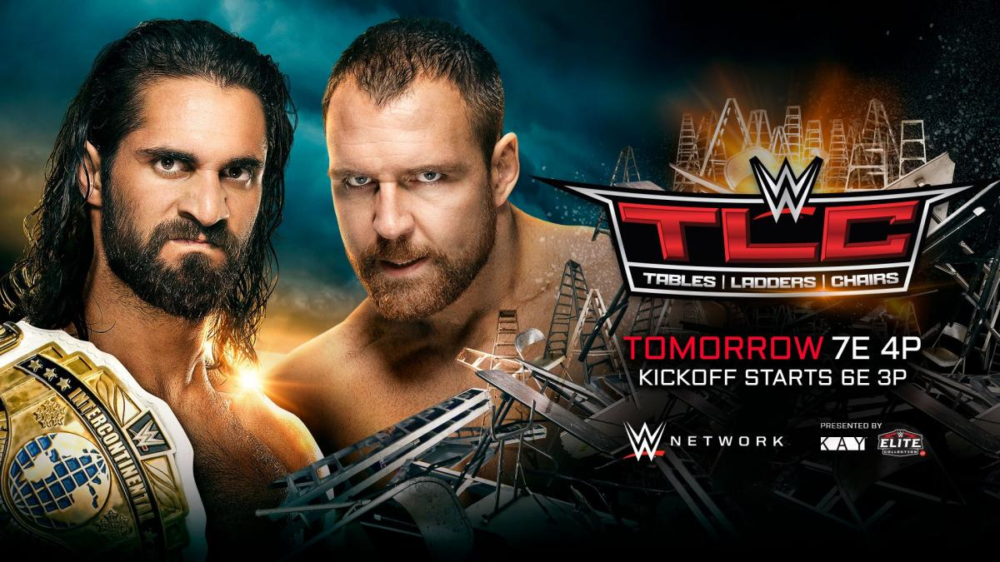

>日期：2018.12.16
>
>地点：加利福尼亚州，圣何塞市，SAP中心

### Intercontinental Championship Match
Seth Rollins (c) vs. Dean Ambrose
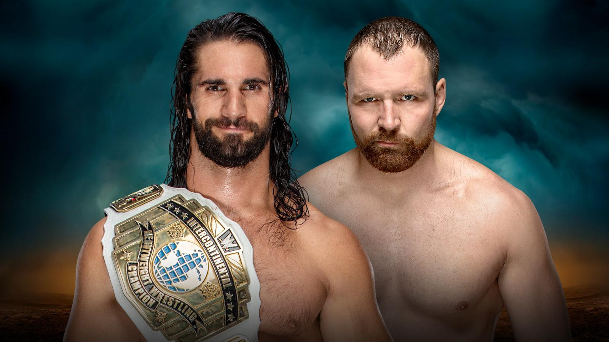

### WWE Championship Match
Daniel Bryan (c) vs. AJ Styles
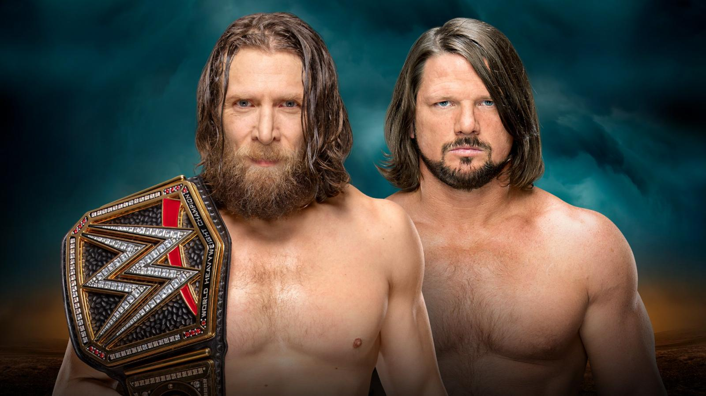

### SmackDown Women’s Championship Triple Threat Tables, Ladders and Chairs Match
Becky Lynch (c) vs. Charlotte Flair vs. Asuka
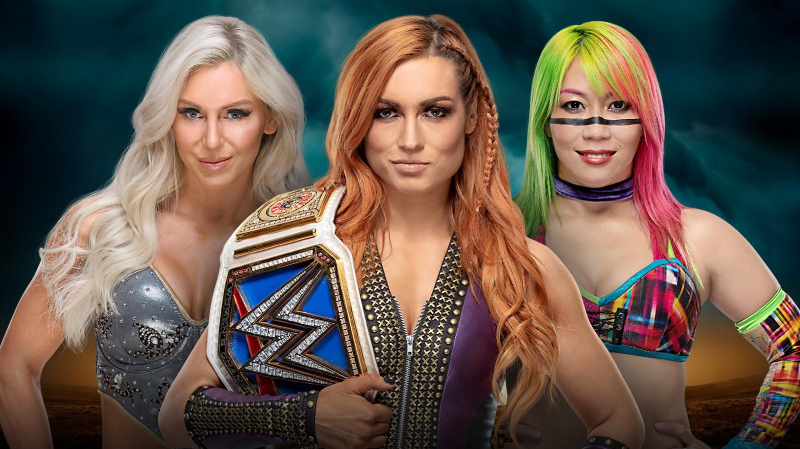

### Tables, Ladders and Chairs Match
Braun Strowman vs. Raw “General Manager-Elect” Baron Corbin 
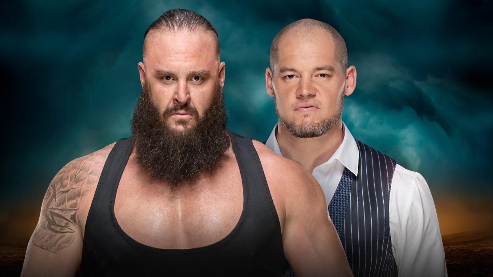

### Raw Women’s Championship Match
Ronda Rousey (c) vs. Nia Jax
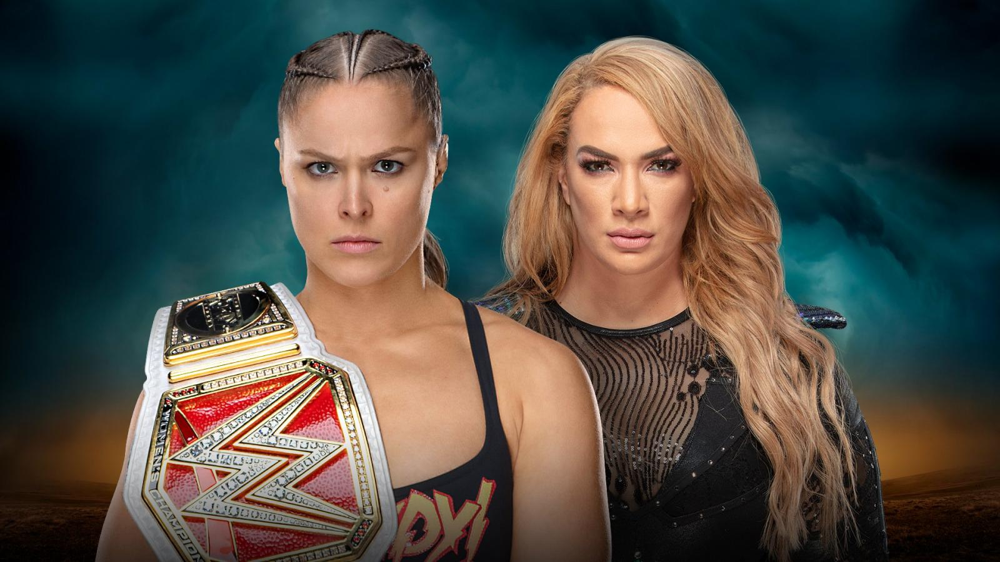

### Mixed Match Challenge Final
Jinder Mahal & Alicia Fox vs. R-Truth & Carmella 
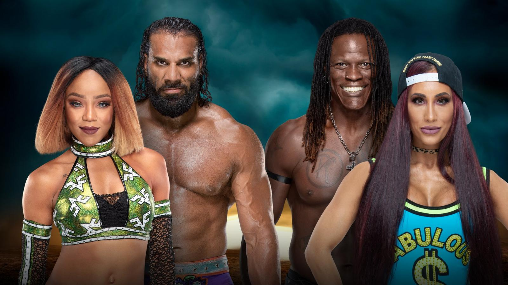

### SmackDown Tag Team Championship Triple Threat Match
The Bar (c) vs. The Usos vs. The New Day
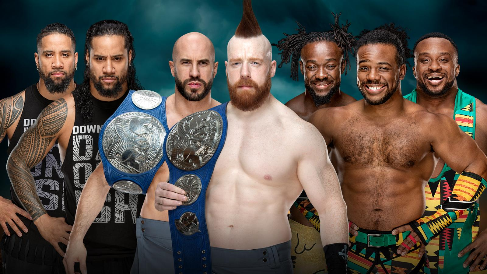

### Chairs Match
Rey Mysterio vs. Randy Orton
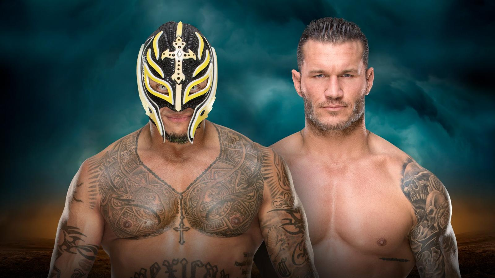 

Finn Bálor vs. Drew McIntyre 
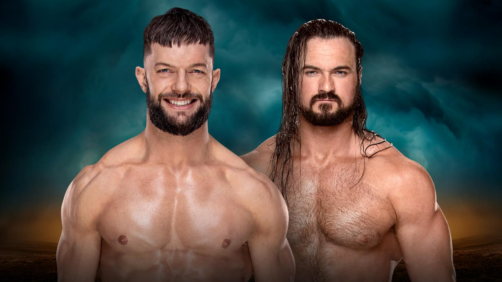

### Ladder Match
Elias vs. Bobby Lashley
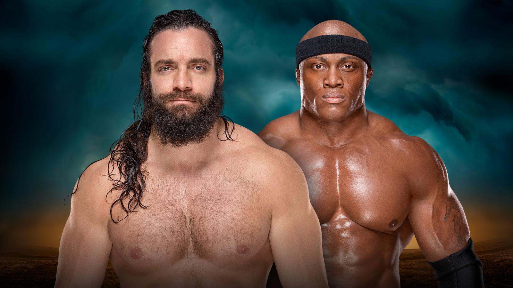

### Tables Match
Natalya vs. Ruby Riott
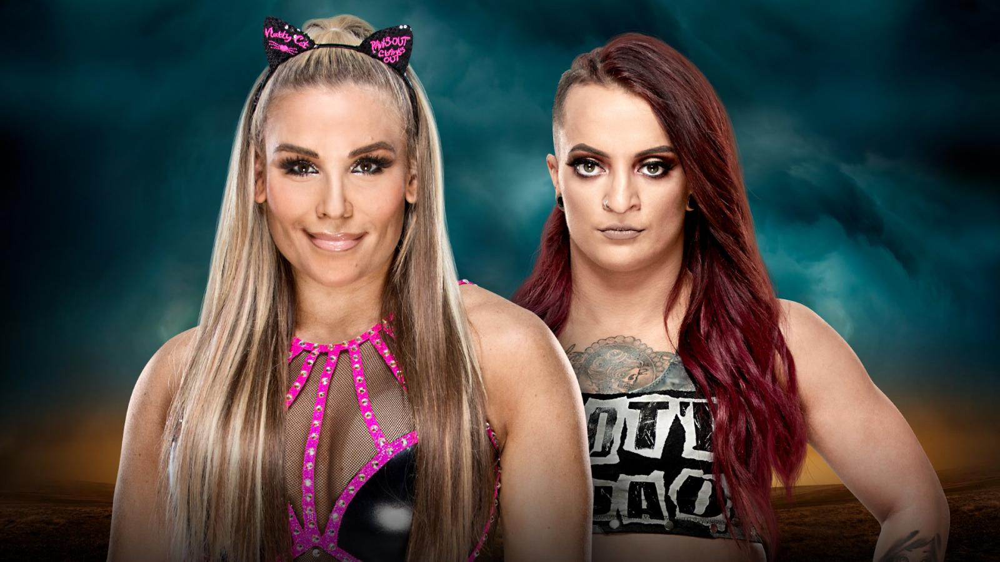

### WWE Cruiserweight Championship Match
Buddy Murphy (c) vs. Cedric Alexander
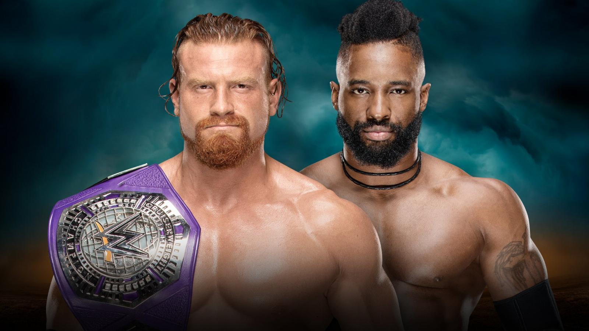

### 赛果：
- Buddy Murphy 战胜 Cedric Alexander 卫冕 WWE轻量级冠军

- Elias 战胜 Bobby Lashley

- Carmella & R-Truth 战胜 Jinder Mahal & Alicia Fox 成为男女混合挑战赛第二季获胜者

- The Bar 战胜 The Usos & The New Day 卫冕 SmackDown双打冠军

- Braun Strowman 战胜 Baron Corbin 成为 Royal Rumble 环球冠军第一挑战者

- Natalya 战胜 Ruby Riott 

- Finn Bálor 战胜 Drew McIntyre

- Rey Mysterio 战胜 Randy Orton

- Ronda Rousey 战胜 Nia Jax 卫冕 Raw女子冠军

- Daniel Bryan 战胜 AJ Styles 卫冕 WWE冠军

- Dean Ambrose 战胜 Seth Rollins 成为新科洲际冠军

- Asuka 战胜 Becky Lynch, Charlotte Flair 成为新科 SmackDown女子冠军