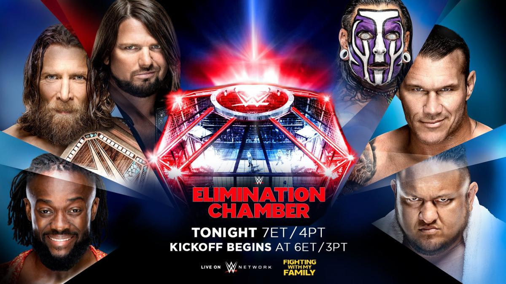
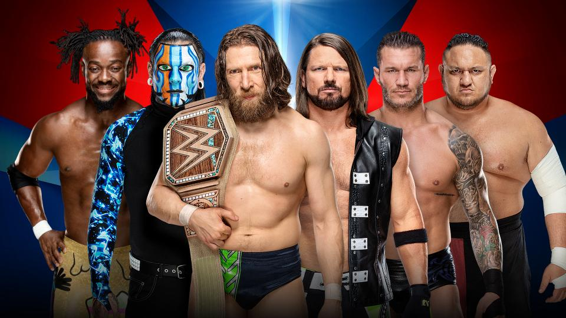
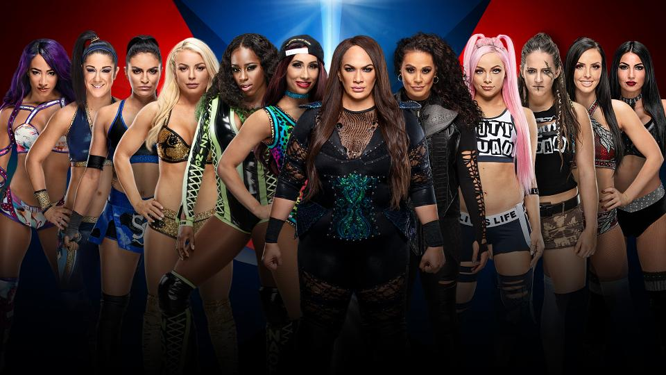
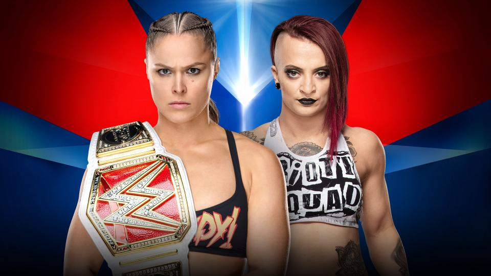
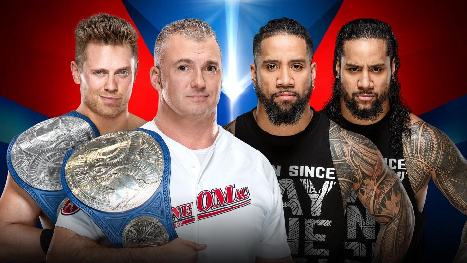
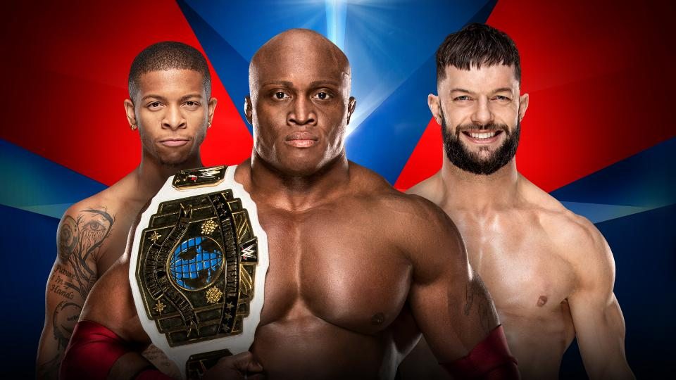
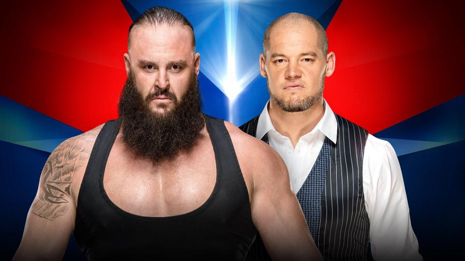
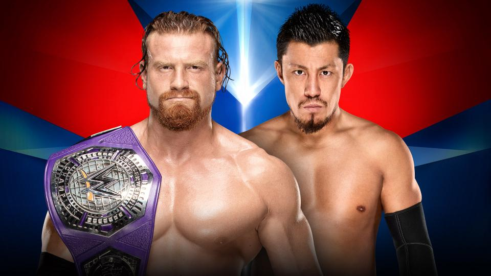

# WWE Elimination Chamber 2019

> 日期：2019.02.17 
>
> 地点：德克萨斯州，休斯顿，丰田中心

### WWE Championship Elimination Chamber Match

"The New" Daniel Bryan (c) vs. AJ Styles vs. Jeff Hardy vs. Kofi Kingston vs. Randy Orton vs. Samoa Joe

### Women’s Elimination Chamber Match to crown the first-ever WWE Women’s Tag Team Champions

Sasha Banks & Bayley vs. The IIconics vs. Nia Jax & Tamina vs. Carmella & Naomi vs. Liv Morgan & Sarah Logan vs. Sonya Deville & Mandy Rose

### Raw Women's Championship Match

Ronda Rousey (c) vs. Ruby Riott

### SmackDown Tag Team Championship Match

The Miz & Shane McMahon (c) vs. The Usos

### Intercontinental Championship Handicap Match

Bobby Lashley (c) & Lio Rush vs. Finn Bálor

### No Disqualification Match

Braun Strowman vs. Baron Corbin

### WWE Cruiserweight Championship Kickoff Match

Buddy Murphy (c) vs. Akira Tozawa

### 赛果：
>
>Buddy Murphy 击败 Akira Tozawa 卫冕 WWE轻量级冠军
>
>Sasha Banks & Bayley 最终获得密室铁笼赛胜利成为首任 WWE女子双打冠军
>
>The Usos 爆冷击败 Miz & Shane 赢得 SmackDown双打冠军
>
>Finn Bálor 击败 Bobby & Lio 成为新科洲际冠军
>
>Ronda Rousey 击败 Ruby Riott 再度卫冕
>
>Baron Corbin 击败 Braun Strowman
>
>Daniel Bryan 赢得密室铁笼赛胜利成功卫冕 WWE冠军
