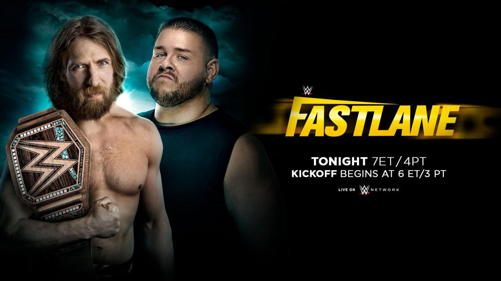
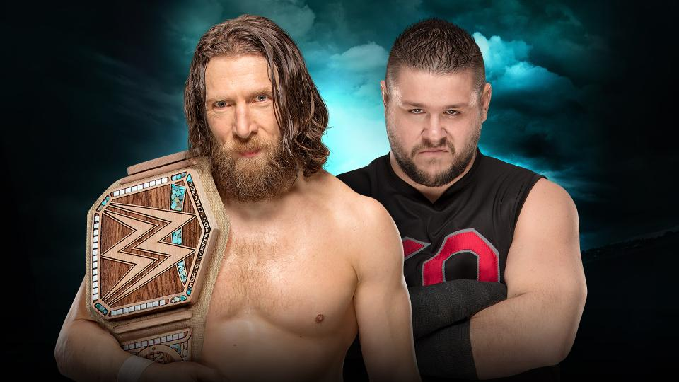
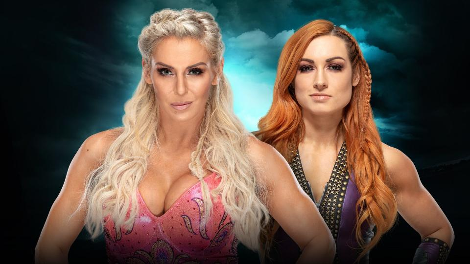
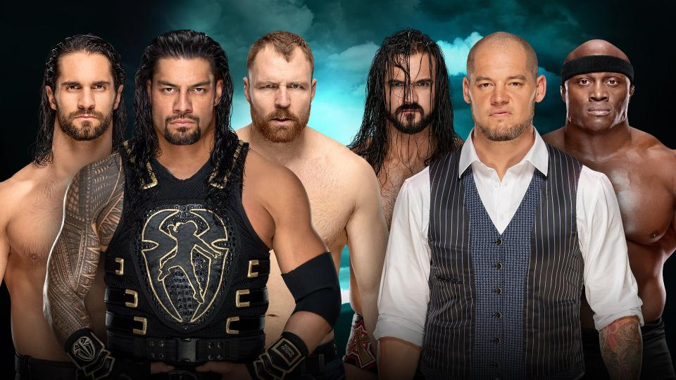
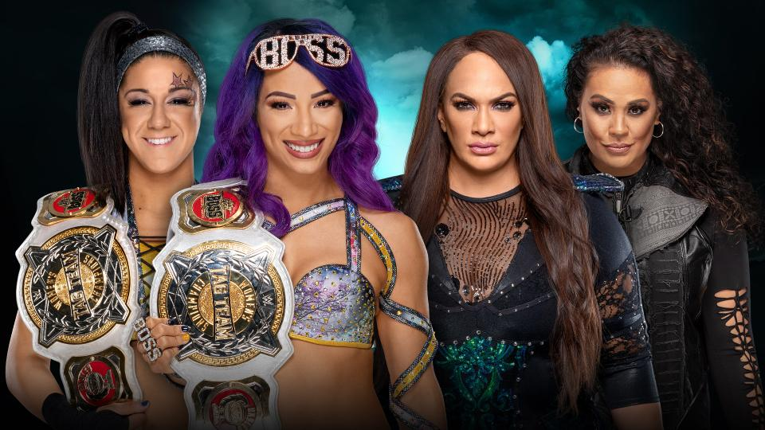
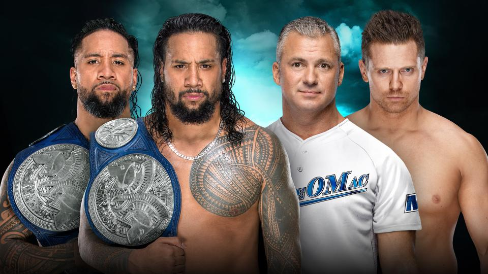
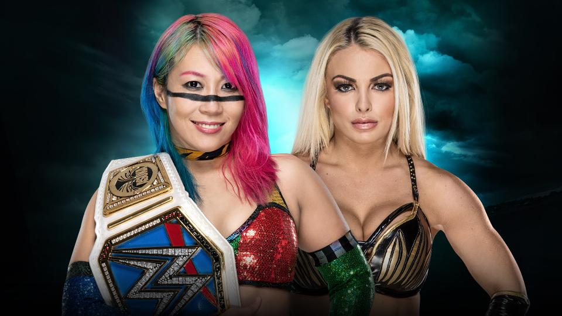
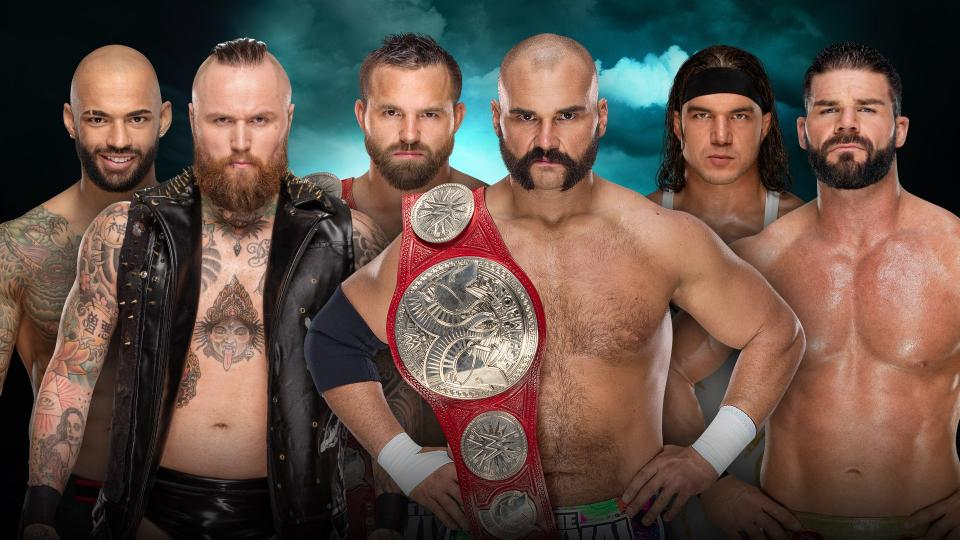
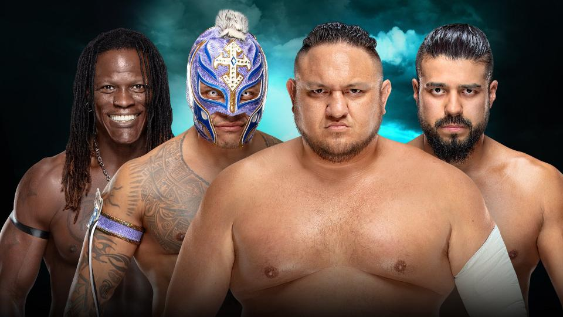
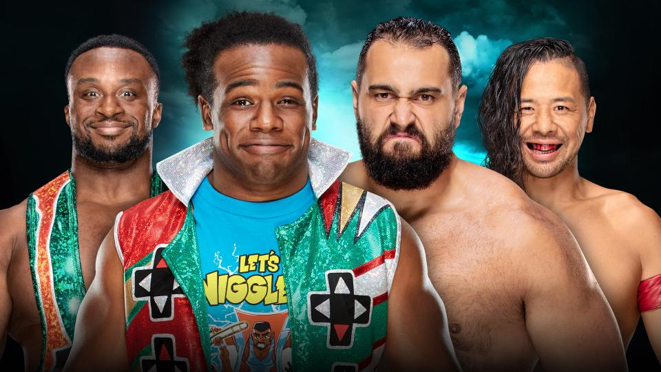

# WWE Fastlane 2019

>日期：2019.03.10
>
>地点：俄亥俄州，克利夫兰市，速贷球馆

### WWE Championship Match
Daniel Bryan (c) vs. Kevin Owens

Becky Lynch vs. Charlotte Flair — 如果 Becky Lynch 获胜，她将获得在 WrestleMania 挑战 Raw女子冠军的机会 

### Six-Man Tag Team Match
The Shield vs. Drew McIntyre, Bobby Lashley & Baron Corbin 

### WWE Women’s Tag Team Championship Match
The Boss ‘N’ Hug Connection (c) vs. Nia Jax & Tamina

### SmackDown Tag Team Championship Match
The Usos (c) vs. The Miz & Shane McMahon

### SmackDown Women’s Championship Match
Asuka (c) vs. Mandy Rose

### Raw Tag Team Championship Triple Threat Match
The Revival (c) vs. Aleister Black & Ricochet vs. Bobby Roode & Chad Gable

### United States Championship Fatal 4-Way Match
Samoa Joe (c) vs. R-Truth vs. Rey Mysterio vs. Andrade
 

### Fastlane Kickoff Match
The New Day (Big E & Xavier Woods) vs. Shinsuke Nakamura & Rusev

### 赛果：
- The New Day 战胜 Shinsuke Nakamura & Rusev

- The Usos 战胜 The Miz & Shane McMahon 卫冕 SmackDown双打冠军；Shane McMahon 赛后袭击 The Miz

- Asuka 战胜 Mandy Rose 卫冕 SmackDown女子冠军

- 2对1障碍赛 The Bar 战胜 Kofi Kingston

- The Revival 战胜 Aleister Black & Ricochet、Bobby Roode & Chad Gable 卫冕 Raw双打冠军

- Samoa Joe 战胜 R-Truth、Rey Mysterio、Andrade 卫冕美国冠军

- The Boss ‘N’ Hug Connection 战胜 Nia Jax & Tamina 卫冕 WWE女子双打冠军；赛后 Nia Jax & Tamina 袭击 Beth Phoenix & Natalya

- Daniel Bryan 战胜 Kevin Owens、Mustafa Ali 卫冕 WWE冠军

- Ronda Rousey 故意攻击 Becky Lynch，使 Becky 通过对手违规战胜 Charlotte Flair 进军 WrestleMania 

- Elias 演唱会后 Randy Orton 攻击了他，随后 AJ Styles 攻击 Randy Orton

- The Shield 战胜 Drew McIntyre, Bobby Lashley & Baron Corbin 