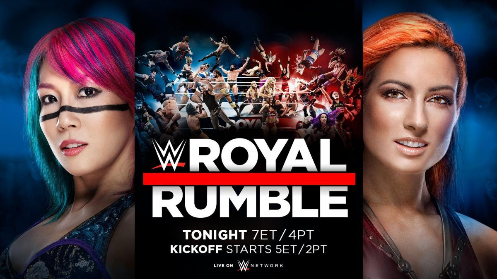
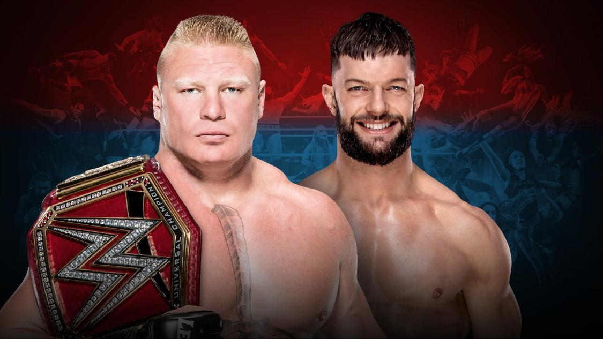
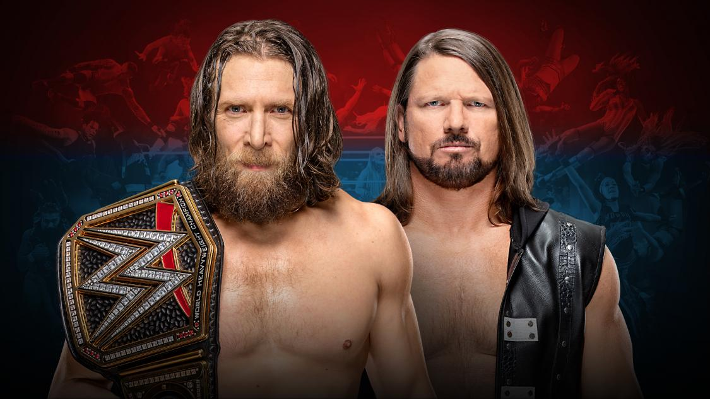
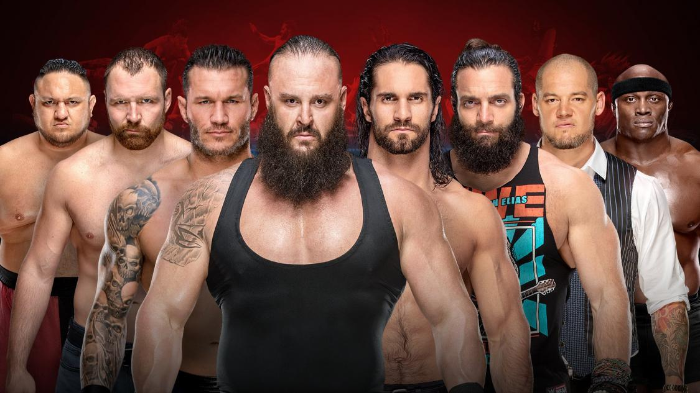
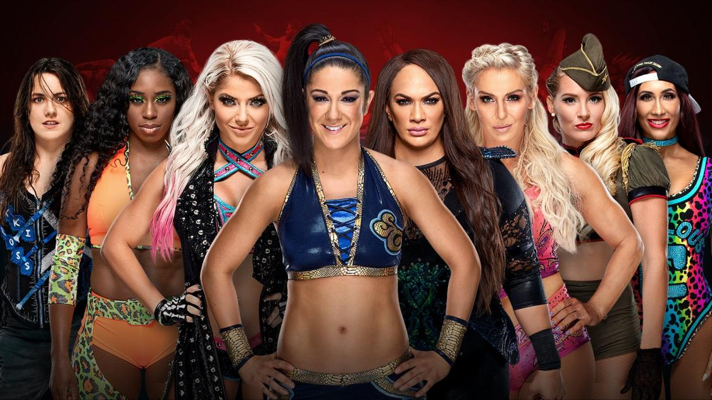
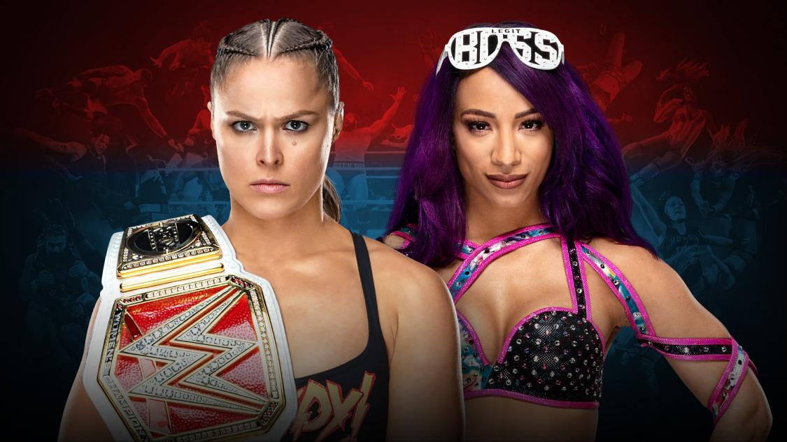
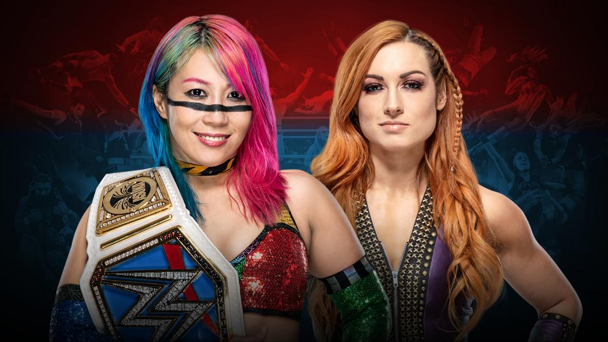
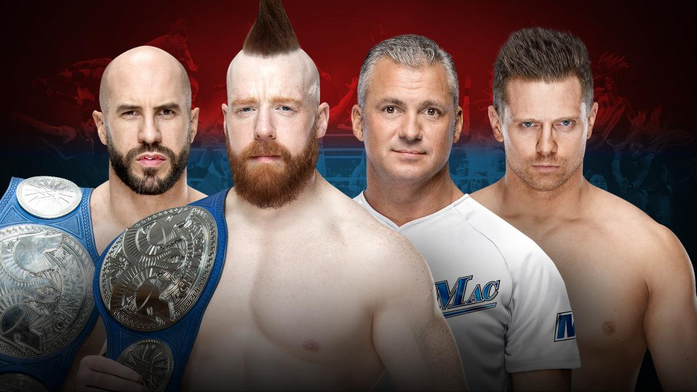
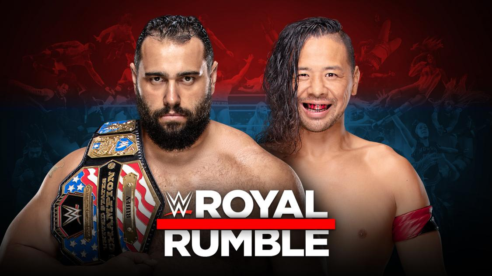
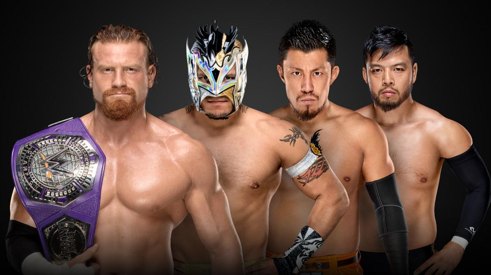

# Royal Rumble 2019

> 日期：2019.01.27 
>
> 地点：菲尼克斯

### Universal Championship Match
Brock Lesnar (c) vs. Finn Bálor 

### WWE Championship Match
Daniel Bryan (c) vs. AJ Styles 

### 30-Man Royal Rumble Match

### 30-Woman Royal Rumble Match 

### Raw Women's Championship Match
Ronda Rousey (c) vs. Sasha Banks

### SmackDown Women's Championship Match
Asuka (c) vs. Becky Lynch 

### SmackDown Tag Team Championship Match
The Bar (c) vs. The Miz & Shane McMahon

### United States Championship Match (Kickoff Match)
Rusev (c) vs. Shinsuke Nakamura 

### WWE Cruiserweight Championship Fatal 4-Way Match (Kickoff Match)
Buddy Murphy (c) vs. Kalisto vs. Akira Tozawa vs. Hideo Itami

### 赛果：
- Bobby Roode & Chad Gable 战胜 Rezar & Scott Dawson 卫冕 Raw双打冠军
- Shinsuke Nakamura 战胜 Rusev 成为新科美国冠军
- Buddy Murphy 战胜 Kalisto、Akira Tozawa、Hideo Itami 卫冕 WWE轻量级冠军
- Asuka 战胜 Becky Lynch 卫冕 SmackDown女子冠军
- Shane McMahon & The Miz 战胜 The Bar 成为新科 SmackDown双打冠军
- Ronda Rousey 战胜 Sasha Banks 卫冕 Raw女子冠军
- Becky Lynch 赢得 2019女子皇家30人淘汰赛胜利
- Daniel Bryan 战胜 AJ Styles 卫冕 WWE冠军
- Brock Lesnar 战胜 Finn Bálor 卫冕环球冠军
- Seth Rollins 赢得 2019男子皇家30人淘汰赛胜利